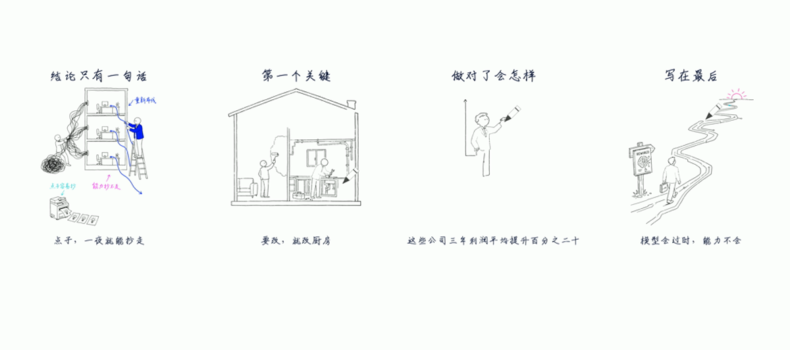
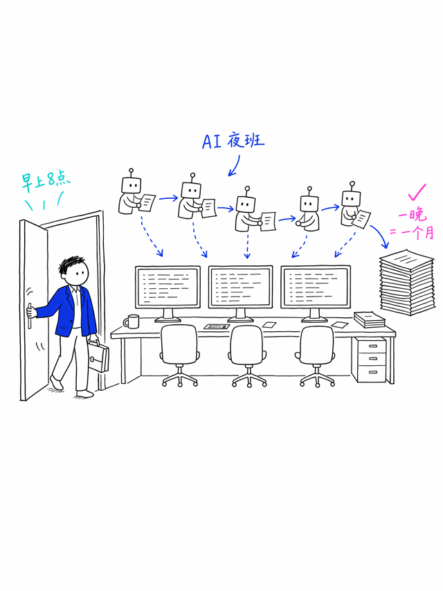
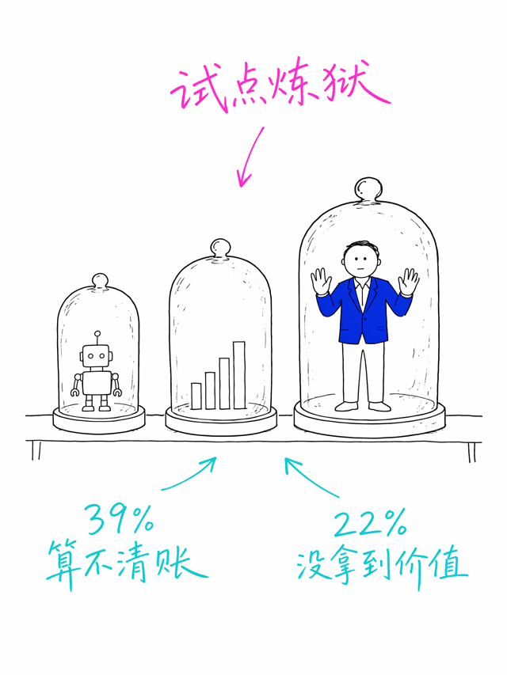
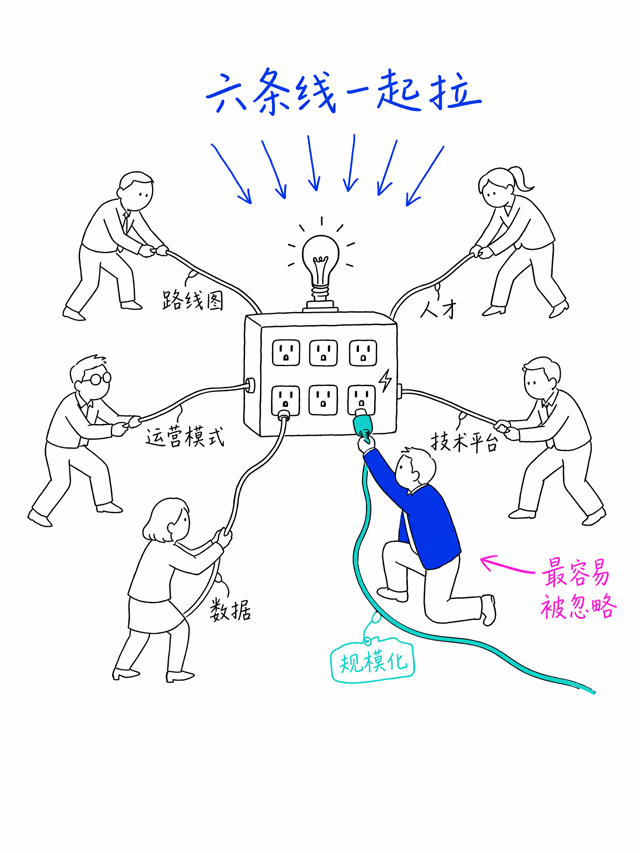

# whiteboard-sketch-video

把文章、书籍解读或观点稿，变成「白板手绘动画」短视频的 Agent Skill：

AI 生成 Notion 风白底黑线插画 → 本地引擎**逐笔画出**（笔尖跟随）→ AI 配音 +
词级同步字幕 + BGM → 竖版 1080×1920 成片。



## 效果示例

| | | |
|---|---|---|
|  |  |  |

## 安装

```bash
npx skills add ZEYUJIANG1991/whiteboard-sketch-video
```

或手动：把 `whiteboard-sketch-video/` 目录拷到你的 Agent skills 目录。

首次使用前：

```bash
bash whiteboard-sketch-video/scripts/setup_env.sh   # 建 Python venv
```

## ⚠️ 需要自备的两个模型接口

本 skill 的绘制引擎是纯本地计算（不花钱），但**生图和配音需要你自己配模型 API**：

| 环节 | 要求 | 默认实现 | 可替换为 |
|---|---|---|---|
| 生图 | 能按提示词出 3:4 白底黑线插画 PNG | GPT-Image 类接口 | Gemini / 万相 / Seedream / 任意文生图 API |
| 配音 TTS | 文本 → mp3 | MiniMax TTS | Azure / 火山 / edge-tts / 任意 TTS |
| 对齐 | whisper 词级时间戳 | mlx_whisper（Apple Silicon） | openai-whisper / faster-whisper |

生图质量直接决定成片质量，建议选中文书写能力强的模型。把你的 API 调用方式
告诉你的 Agent，它会自行接入——管线只消费"PNG 文件"和"mp3 文件"，不关心来源。

其他系统依赖：`python3`、`ffmpeg`。

## 使用

对你的 Agent 说：

> 用白板手绘视频 skill，把这篇文章做成 2 分钟的视频：<文章路径>

或单图模式：

> 把这张图做成白板手绘动画：<图片路径>

## 🎨 品牌定制（换 VI 色 / 换吉祥物 / 换字体）

所有品牌差异都收敛在 `brand/<pack>/` 三个文件里，**管线代码零改动**：

| 文件 | 管什么 | 怎么改 |
|---|---|---|
| `brand.json` | VI 三色 hex、字体路径、画布横竖版、布局、笔尖模式（pen/hand/none） | 机读参数，直接编辑 |
| `character.md` | 主角/吉祥物的生图 prompt 块 | 换成你的 IP 描述（示例见 `brand/examples/mascot-ip-example.md`） |
| `palette.md` | 写进生图提示词的色彩语义 | 换三色与语义，保持"黑主体+白底+彩色只做焦点" |

新品牌 = 复制 `brand/default/` 为 `brand/你的品牌/`，改这三个文件，
项目 `project.json` 里 `"brand": "你的品牌"` 即生效。

默认品牌包是 bcc 创新咨询（蓝 `#0125df` / 青 `#22c1cd` / 粉 `#ff58f9`，
主角为"蓝西装小人"）。

## 工作原理

- **逐笔绘制引擎**（`scripts/wb_engine.py`）：对 AI 生成的 PNG 线稿做骨架化 +
  最近邻笔顺排序，生成 order map 逐像素揭示——黑色线稿先画、彩色填色与批注
  后画（手绘→上色两阶段），无需矢量化（centerline 描摹在笔画交叉处会断线）。
- **合成器**（`scripts/compose.py`）：读 `project.json`（分镜帧表）+
  `brand.json`（品牌参数），逐帧合成幕标题（同样逐笔写出）、插画、字幕、
  笔尖，管道进 ffmpeg。
- **音画同步**：口播稿 → TTS → whisper 词级时间戳 → 强制对齐出字幕与每幕
  起始帧，画面节奏由旁白驱动。

详细流程与踩坑记录见 `whiteboard-sketch-video/references/workflow.md`。

## License

MIT（不含任何字体与手部照片素材；手部指针模式请自备 PNG 并在 brand.json 中指定路径）
